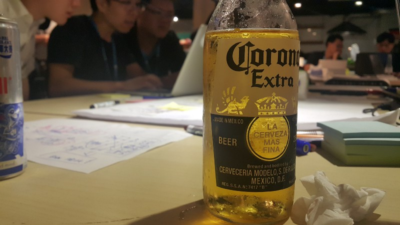
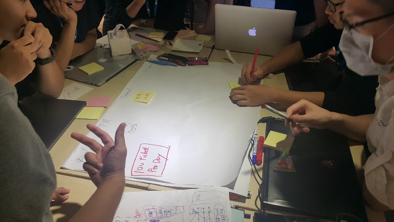
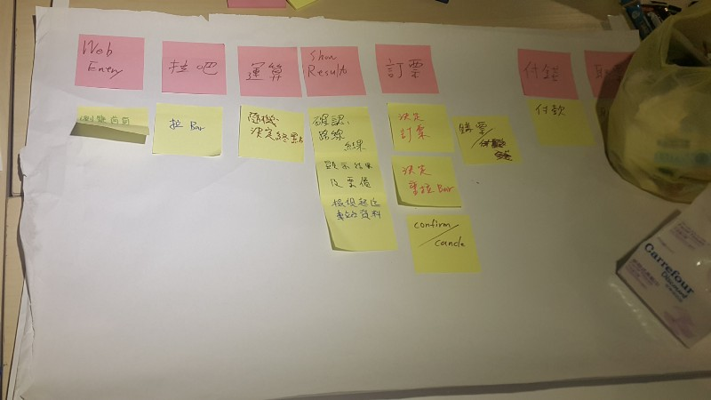
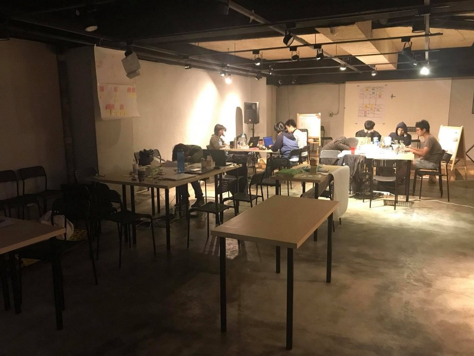

# 敏捷24小時戰鬥營

人生第一次參加類似黑客松的活動，在活動訊息出來時還很興奮的傳給同事看，想辦法鼓吹看有沒有人一起入坑。

but…人算總是算不過天，沒人想跟我一起去玩，只能當場找人組隊。

當天六點準時下班，但我太小看週五下班時的交通車潮了，公車坐了一個多小時到了捷運圓山站，早知道坐捷運了…Orz

到了活動地點己經都八點了，現場大家都組好隊了，只能先等等下一場各組Demo 想法的Session開始，再決定要加入那一個隊伍。

就在旁邊觀察各組在做些討論的同時，Diro、Jared 看我可憐(?)直接問我要不要一起組隊，就這樣加入了團隊，現在想想這一切都是緣份啊～

快速的認識 Diro、Jared、Jess、Laura、小林，以及後來再加入的Arthur及Dino，就這樣八個人組成了這個團隊。

一開始先同步了一下要進行的方向，就馬上先決定要用那些技術來實作。在了解各自的能力後就快速決定好要使用 Web 前端 ＋Web API 的方式來實作。

各自的分工為

Arthur：Web API 架構設計與實作

我：德鐵 API 串接與實作

小林：帶著 Diro、Jared、Jess、Laura 一起寫 Web 前端

只有小林熟 Web 前端，所以幾乎是大家邊學邊做 Web 前端，在24小時內拼出很棒的網頁來，真的很厲害。

## 決定方向

在正式開工前，Arthur 提議要不要試著用 Impact Map 及 User Story Map 先來決定我們的 Road Map，並決定出我們的第一版 MVP 會是什麼樣的產品。這事初看似乎又佔掉了一些可利用的時間，但事後來看當初做這件事是非常正確的，因為所有人都非常明白要做出什麼樣的產品，並專注在第一個 feature 的開發上。

我所負責的工作其實算是相當單純的，就是讀德鐵 API 說明文件並實作串接，但後來才發現這一切都不是這麼簡單的啊。

首先，文件與 Sample Code 故意埋了一些地雷，每一支 API 所埋下的地雷又不盡相同。本來是想先用PostMan 先試著打打看，才發現 API 的認證機制裡必須包含當下 UnixTime Stamp 一起做 MD5 產生。試了幾次後發現 Time Stamp 有個容忍值，不能離當下時間太遠，否則會認證錯誤。

## 第一回合-開始

我決定先寫個簡易的 SDK ，再加上 Unit test 來加速我的測試過程。就在我研究 API 規格的同時，Arthur 己經在建立整個 API 專案的基礎架構， 等到我己經有個簡易的 Production Code及 Unit Test 可以反覆進行測試時，時間己經來到凌晨12點半了，此時才是戰鬥的開始。

測試了約莫一個小時，第一個 API 仍舊無法順利打通，百試不得其門而入的情況下，Member 們也很關心到底順不順利，只好找人求救了。

But…現場除了一群挑戰者之外，僅剩 John 和工作人員，教練都回去休息啦 XDD

只好問問 John 。但 John 就像是 RPG 遊戲裡的 NPC 角色一般，要問對問題他才會回答你…Orz

最後我成功拿到一點點提示 XDDDD

前面我為什麼會說文件與 Sample Code 故意埋了些地雷，因為剛拿到的提示是文件裡都沒有寫的…Orz

就在不斷的嘗試，與不斷的推測 API 的處理邏輯，終於在4點半左右完成第一個 API 的串接，這時候我的精神也燃燒得差不多了，同 Team member 也有幾個先回家梳洗休息一下，距離下午五點的 Demo 剩不到12小時，為了能夠再支撐剩下的時間，就趴著小睡一下。

## 第二回合-休息後再繼續

六點半，一直照顧我們吃喝拉撤的 John 帶來了麥當勞早餐，小睡了一會又吃了早餐精神似乎就回復了大半，回家梳洗的成員也一一的回來了。大家一一的同步彼此的進度及接下來要做的部份後，我也開始進行第二支 API 的串接。

有了第一支API的經驗後，第二支API 在串接時當然也不意外的又撞牆了XDD。但很快的就把牆給撞過去了，大約九點左右就完成了第二支 API 的串接。第三支 API 也很快的在11點左右完成，最後一支也在下午一點左右完成。為什麼這幾支串接可以這麼快的完成呢？因為我直接找了教練來直接與他對測 API ，當場對測完畢。這事告訴我們，只要找到對的人就可以快速的解決問題。

距離最後的 Demo 剩下四個小時的時間，就在不斷的調整、優化程式並與FrontEnd 進行整合，有空的 Member 就抓緊時間不斷的進行測試並提出優化建議。

## 教練的 1 on 1 Review

下午三點，有個與柴叔 1 on 1 Review Code 的機會，柴叔給了我許多的建議，也點出了我許多在實作時沒想清楚的點。像是：

1. 我所寫的這些測試不能稱之為 Unit Test，它只是我為了驗證 API 該如何呼叫以及學習 API 的使用所寫出來的程式，它頂多可稱之為 經驗測試。僅止是為了學習而寫的，實際上對於產品的可靠性沒有任何幫助。
2. 應該用更有效的工具學習，就可以省下寫測試程式的時間。例如柴叔就提到了 git 所提供的 command shell 工具，它就內建了許多的指令，例如用 curl 就可以呼叫 API，也內建 md5 編碼的指令。善用這些指令就可以測試 API 了。
3. 我寫了個基於德鐵 API 所提供的功能的 SDK，德鐵 API 有4支，SDK提供的功能也有4個，看似非常合理。但柴叔認為寫SDK的目的應該是為了提供產品整合，不應該依賴實作。例如我們的產品操作流程就是 查詢 > 訂票，兩個步驟，那我的 SDK 就應該只提供兩個功能就好，呼叫德鐵 API 的行為就應該包裝在 SDK 內就好，不需要讓前端知道。
4. 柴叔指出我肯定沒有用 TDD，有用 TDD 的話就不會寫出這樣的 SDK。沒錯因為我想的是該怎麼把 API 串起來，而不是該怎麼實現產品啊。
5. 柴叔觀察了我們許久，發現每個人都只專注在各自的目標在工作，而不是為了團隊的目標，最明顯的一點，每個人對於最後整合的時間認知都不一樣。也的確，大家都很認真的專注在自己要做的工作，而忽略了彼此交流與同步進度。

## 最後

最後，我們很幸運的被評選為第一名，為什麼說很幸運？我覺得我們每個人都努力的將自己畢生的功力都拿出來了，不過卻沒有很好的整合，因為我們都太專注在自己的工作上了，缺少了彼此與團隊的溝通，中途的 Retro 做得太少，導致最後的幾個小時我們不斷的在做產品的調整。

身為第一名也不是只有一個名次而己，更取得了 Agile Tour 2017 早鳥票的資格，而 Odd-e 更提供未來任何一門課程的優惠及德鐵訂票系統上車票優惠，這超棒的啊，只是歐洲車票不知道何時才有使用的機會 XDD