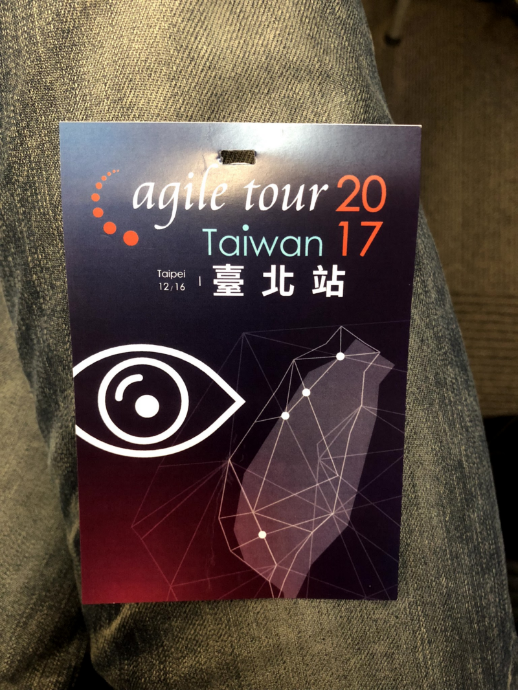
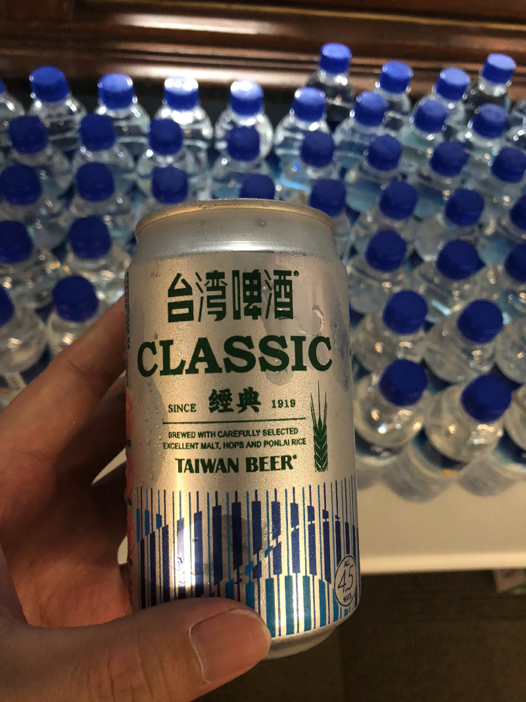
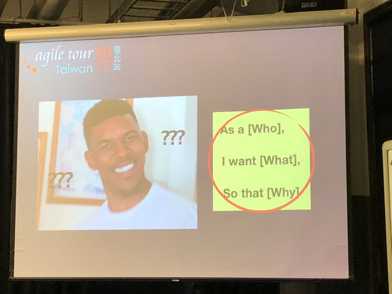
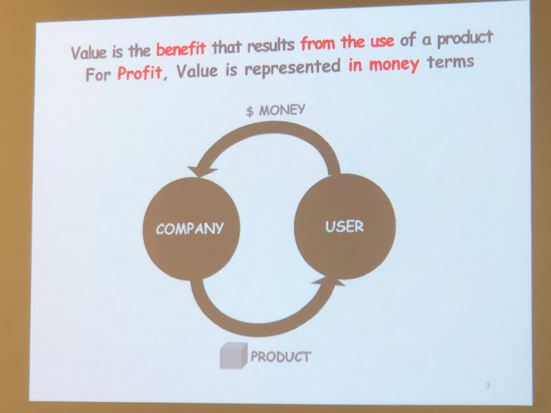
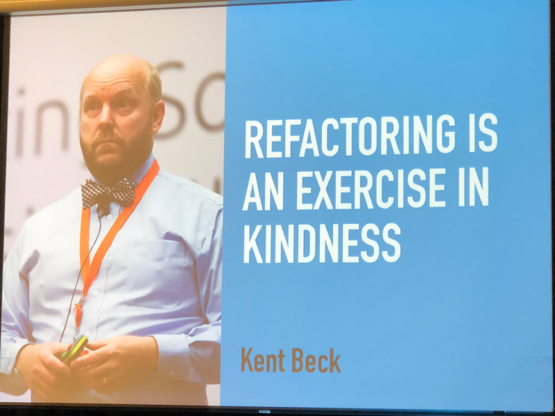

# Agile Tour Taipei 2017

參加 Agile Tour 活動第三個年頭，雖然天氣不太好，不時飄著細雨，但並不能阻擋促成這場大會的志工們。感謝這群志工，有你們才能讓我們能夠在這個場合中互相交流學習。

## Agile In Transition and In Business World — Mick Chung

一早就由 Mick 分享 Agile 團隊在商業世界裡所面臨的挑戰，以及如何以 Agile Contract Team 的模式來解決傳統合約難以使用 Agile 的手法來進行產品及服務的開發。Agile Contract 今年不斷的在社群中被拿出來討論，可能台灣的環境仍然以如期、如質、如成本的觀念在談合約。現今比速度的時代，這個月的規劃可能下個月就要做調整了，傳統合約無法給予彈性的情況下，變成 Do Agile 而非 Be Agile。

## 敏捷商業分析 — Lisa Chu

這一節的分享真的比較適合做產品規劃/企劃的人來聽，個人的感覺目前在 Run Agile 的還是以軟體開發的 IT 人為主，然而產品規劃者若沒有敏捷思維，容易變成一個公司各自為政的狀況。

## Let’s build an User-Centered Team — 張朝智

Agile 有幾個可以幫助了解 User 的工具，像是 Personal、User Story…等，但做了這些難道就真的了解 User 嗎？在這一節中講者分享了 UX、UX researcher 的經驗，包含該如何訪談使用者、專業的觀察室…等。我以前任職的遊戲公司其實也有相關的設備、設施，但卻從來沒能夠了解用途，在這一次的分享中更瞭解了這些設備的用途。

## 高效溝通 — 揭開促進團隊效能的密碼 — Percy

Percy 分享六個團隊溝通的技巧，內容真的很豐富，可惜時間不夠，最後也只能分享其中二個技巧。打破以前認為不可能的事，其實不是不可能，而是我不會、不懂得運用。

## Get better at Refactoring — Stanly Lau

Stanly 是來自 Odd-e 的敏捷教練，分享的也是我近來最有興趣的主題。Stanly live demo 了 refactoring 常用的幾個方法，更分享了他認為要精進 refactoring 的幾個方向，這也啟發了我明年所訂定的目標與方向。

## Retrospective

今年的收獲真的很多，在學習 Agile 的路上也一路認識許多一同在這條路上努力的前輩與同好，回顧 2017 年也做了不少事來改變自己讓自己能夠不斷的成長，but 總有可以學習仿效的人事物。2018年即將到來，期望自己能夠繼續前進。