# System Thinking 工作坊參加心得筆記

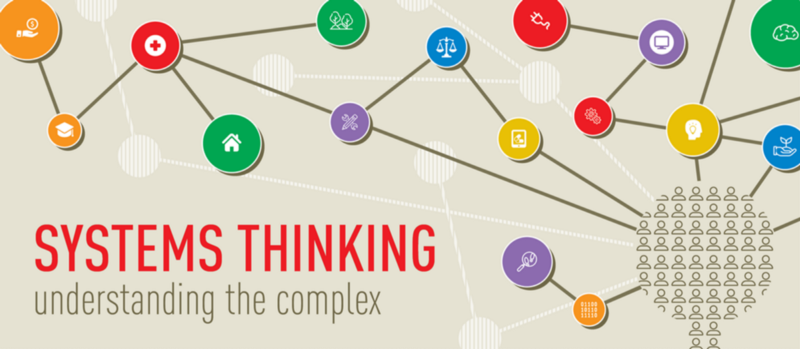

年初 Taco 桑在新竹辦一整天的 System Thinking WorkShop 其實心裡就一直掙扎到到要不要衝到新竹去參加，就在猶豫掙扎的過程中票就賣完了😱

後來看到在台北開了2場 [系統思考工作坊 社群日間版](https://www.facebook.com/events/151865585443241/)，當然就是想也不想的先報名再說。

## 什麼是系統思考（System Thinking）?

在 Taco 桑的投影片裡是這麼說的

>系統思考將有助於我們發現問題的根本原因，看到多種可能性，從而讓我們更好地管理、適應複雜性挑戰，把握新的機會。

看到了嗎？系統思考不單單只是為了發現問題的根本原因，更重要的是能夠更好地管理並從中把握新的機會，而這會是你比其他人能夠更進一步搶得先機的能力。

## WorkShop 內容

### 分組活動

活動一開始 Taco 桑先帶著大家先自評自己對於 System Thinking 的理解程度自己評分，並依據分數高低圍成一個圈圈，再依序將參與者打散到各組。

從這個簡單的分組活動 Taco 桑開始帶著大家回想剛剛的過程中發生了什麼事。

- 自評：每個人先依據自己對於 System Thinking 的理解程度自評分數。
- 圍成圈圈：很奇妙的大家就會自己組成一個圈圈，一開始圈圈不夠大，有些人組不進來，大家就開始自我調整，將圈圈放大。
- 見縫插針：放大的過程中就開始會有人只要看到小縫就插進去，讓自己盡快成為圈圈的一份子。
  
在這過程中 Taco 桑讓我理解到

>每個人都是一個系統，而系統與系統間會有相互影響

### 活動：用畫圖來表示如何做早餐

在這階段 Taco 桑讓我們每個人用一張 A4 紙試著畫出如何做一頓美味的早餐，我用了我笨拙的畫圖功力努心畫出了這幅畫。

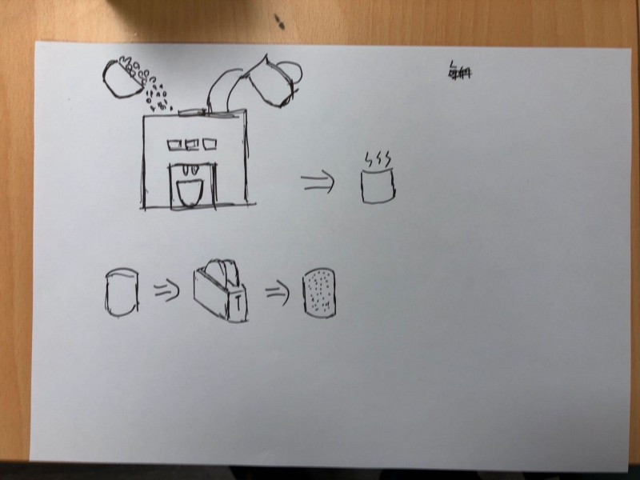

畫完後與同組成員互相交流彼此的畫作，可以發現每個人對於畫畫的表現方式都不盡相同，但相同的是大多都會用箭頭來表示流程，用各自獨立的物品來表現動作。

接著以組為單位來畫一張如何做早餐的圖。

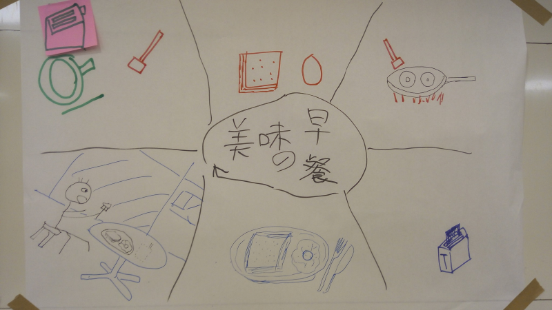

在這活動中整組畫出了這張圖，看得出來圖上的六個區塊是由不同的人畫出來的，但我們卻能夠彼此了解夥伴們畫的是什麼，這是個 Share Understanding 的體現。

在這裡帶出了在團體進行 System Thinking 時的一個精神，「一顆心、一張紙、一個要解決的問題（目標）」。

### 系統的構成

物件、物體、元素：在系統中的任何物體都是系統裡最基本的單位，而每個單位又可視為是個獨立的系統。
連結：物件之間的交互影響關連，在系統裡每個物件可能有關連可能沒有關連，而這關連會是個因果關係。
目的性：幾個關連可能會形成某種目的性，進而產生一個事件。

### 系統語言

在系統思考裡我們用系統語言來表現系統的運作方式，最主要有三個元素。

變量（Variables）：可以有數據來表示的單位，例如：成本、利潤。
環鏈（Links）：是指任兩個變量之間的因果關係，例如：訂單數越多→營業額越高。
環路（Loops）：是指數量環鏈所形成的迴圈，例如：訂單數越多→營業額越高→利潤越高→行銷預算越高→品牌知名度提升→訂單數越多
用變量、環鏈、環路所畫出來的圖則稱之為 CLD（Causal Loop Diagram）因果循環圖。

## 以麥當勞早餐為例子

### 第一步、找出變量

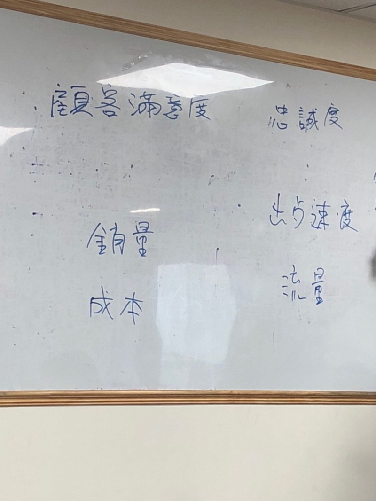

找變量的方式有兩種，一種是從 Domain Know How 去找，另一種是從現有的分析數據去找。

### 第二步、找出變量間的環鏈及正/負相關性

把每個變量分別比對，找出之間的環鏈，並對於環鏈的相關性進行定義，這步驟相當重要，定義正確與否會影響最後對於系統運作方式的判讀。

環鏈有分為正相關及負相關，會用 S/O 或 +/- 來表示正向或負向關係

S/O：Same / Opposite

+/-：正相關、負相關

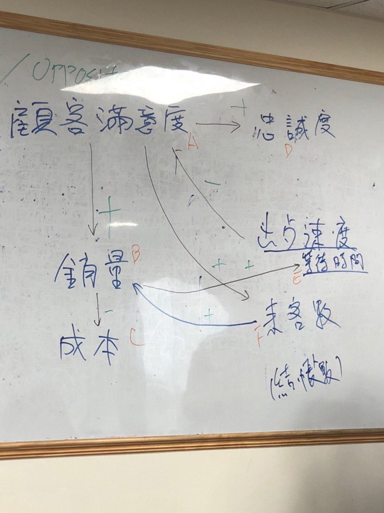

### 第三步、找出環路

變量夠多、環鏈都找出來的情況下就可以在系統中找出環路，環路會形成圈圈，在這圈圈裡的變量代表彼此互相影響。而環路又分為加強環路（Reinforce）及平衡環路（Balance）

#### 例子：平衡環路

顧客滿意度（A）→ 銷售量（B）→ 等待時間（E）→ 顧客滿意度

顧客滿意度越高，造成銷售量越高；銷售量越高，造成客戶等待時間越久；而客戶等待時間越久，則造成顧客滿意度越低。

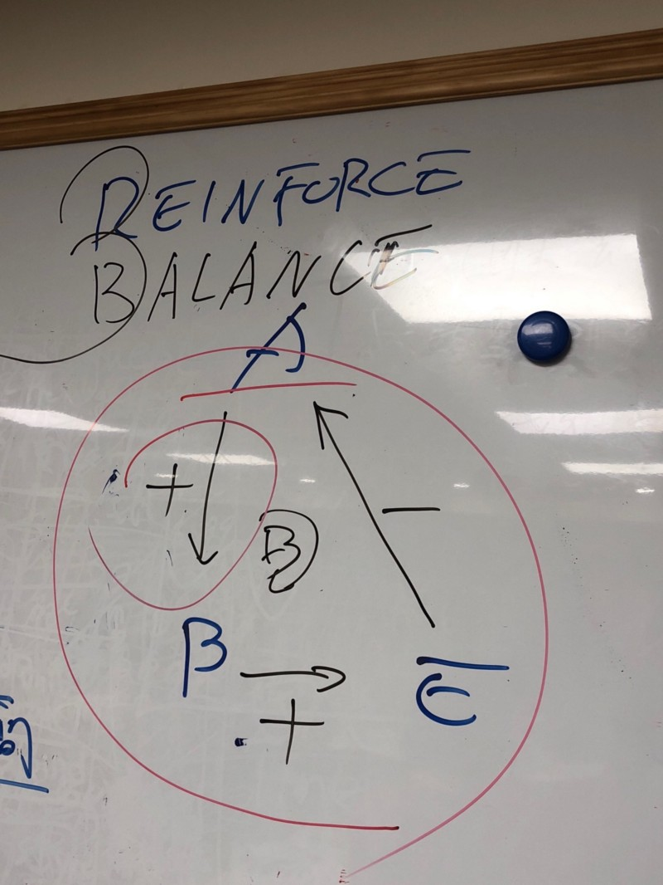

#### 例子：加強環路

銷售量越多，則來客數越多；來客數越多，則銷售量越多。
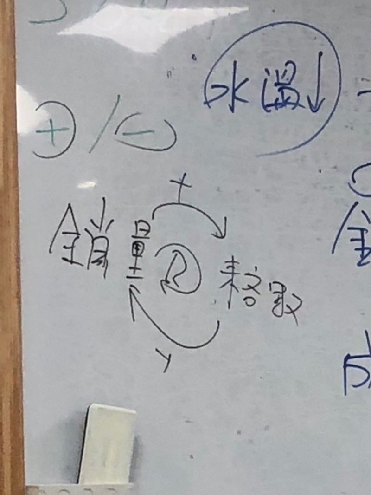

### 小組討論

經理人為了挽救預算的系統思考案例。在預算不足的情況下身為一個經理人如何用系統思考來緩解預算不足的壓力。
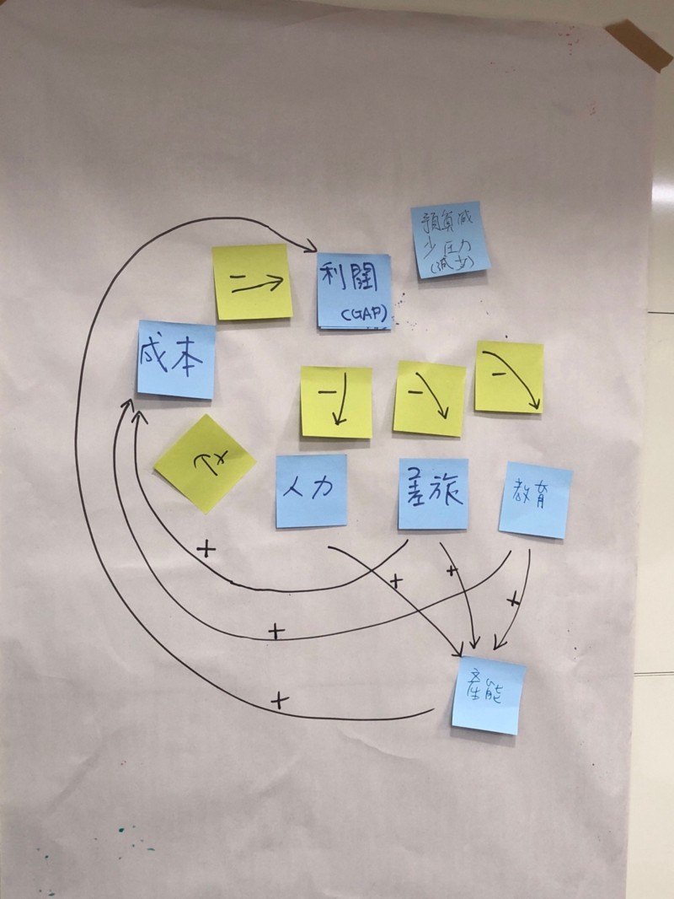

## 我的反思

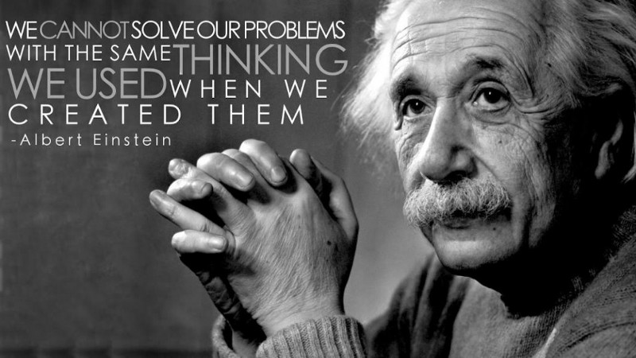

平常在設法解決一個問題時通常會去思考這個問題所發生的原因，只要解決這個原因通常就能解決這個問題。但更多的是為了解決今天所發現的 Bug 所寫的 Code，明天又會產生出新的 Bug 。

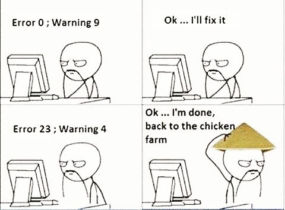

尤其在大型系統，一個問題很有可能是經由不斷的互相影響所產生的，此時冒然去修改它可能會得到完全無法預期的結果。而系統思考就是幫助我們能夠在尋找問題的過程中先看見全貌找出因果關係。這時再下手去解決它勝率就會大得多了。

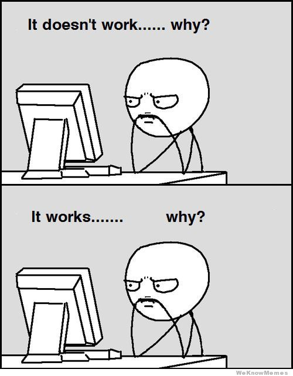

除了用來解決問題外，我認為系統思考應該也可以用來分析個人職涯的現況，了解自己身處的位置，定出未來的執行計劃與可能的機會應該也挺不錯用的。