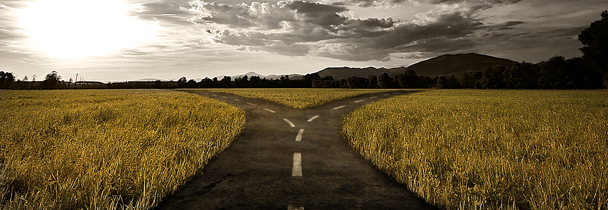

# 人生的十字路口



## 「人生就是不斷的選擇」

忘了是在何時聽到這句話，但直到現在仍然十分認同這句話所暗喻的意義。

1/8晚上在引導者聚會的主題是「人生的十字路口」，Vince 介紹了他前兩年去參加引導者論壇時所參加的一個 Session -『交叉路口』（Crossroad）。

這個桌遊是由東京『慶應大學』（Keio University）的『吉川肇子』教授（ キッカワ トシコ; KIKKAWA TOSHIKO）根據 1995 年的日本阪神大地震於 2003 年所設計出的『模擬遊戲』，同時於 2004 年時在京都大學正式發售，並已申請註冊智慧商標。

## 當你遇上這些難題時，你會如何選擇呢？

試想：

```Text
[角色]如果您是社區的義消
[情境]發生大地震了！你正在海岸規勸民眾離開。但這時傳來海嘯警報，20分鐘後大海嘯即將來襲。您會留在原地，繼續勸導疏散嗎？
```

```Text
[角色]如果你是一個上班族
[情境]你所任職的工作是個穩定、不需要加班、每天準時上下班。正當你覺得工作不會有任何變化時，你意外獲得另一個新工作機會。而這新工作除了能夠給予你更好的薪資外，極富挑戢性，但必須離開台灣到外地工作，你會去嗎？
```

```Text
[角色]如果你是一個公司基層主管
[情境]你的部門裡有一個員工與老闆發生了嫌隙，老闆盛怒之下要求你把這個員工給開除，並讓這個員工以自願離職的方式離開公司。你會遵從老闆的要求來處理這個員工還是拒絕呢？
```

## 遊戲方式

每個人寫一個自已實際碰過或是聽過、看過的難題，在紙上寫上「角色」與「情境」，並以封閉問題格式來撰寫。

寫完後每個人輪流說明自已所寫下的難題內容，先進行詢問與會者會做下何種決定以進行第一輪的投票。投票後先請票數少的一方先說說為什麼做這個決定，之後再請另一方表達不同的看法。

經過一輪討論後，就可以再進行第二輪的投票，這時票數可能會有一些變化，就可以讓想法改變的人再說說原因。

結束後就換下一個人再重複上述的流程，直到所有的難題都被討論過。

## 活動心得

每個人因為有著不同的經歷而有不同的觀點，在同一個問題每個人所做出的決定自然也有所不同。每一個難題雖然是以封閉問題的形式被提出來，在過程中每個人都可以為自己的決定提出看法，在這樣的過程中參與者彼此互相交換看法。而難題之所以是難題，有時是因為自己對於這個選擇可能沒有較為明顥的觀點，以致於選擇那一邊似乎都不對，或是心中捨不得另一個答案。

也許好好的問問自己，自己最在乎的是什麼？內心的渴望、自我又是什麼？也許往後再次站在十字路口上時， 就能夠心無罣礙的做下自己的決定，創造獨一無二的人生。

## 參考資料

- [不會睡著的防災課：日本防災遊戲「十字路口」翻轉你的災變想像](https://www.thenewslens.com/article/36795)
- [【生命中的一堂課】@Crossroad: An innovation tool for facilitation @IAFKorea2017](https://medium.com/%E7%94%9F%E5%91%BD%E4%B8%AD%E7%9A%84543/%E7%94%9F%E5%91%BD%E4%B8%AD%E7%9A%84%E4%B8%80%E5%A0%82%E8%AA%B2-crossroad-an-innovation-tool-for-facilitation-iafkorea2017-2278c73dc861)