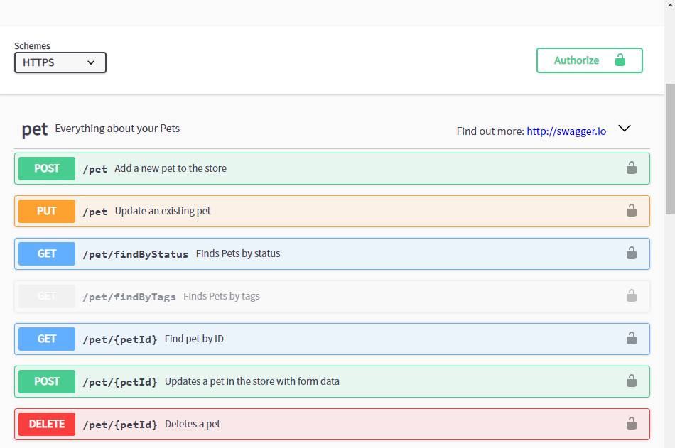
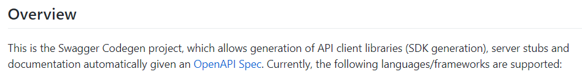
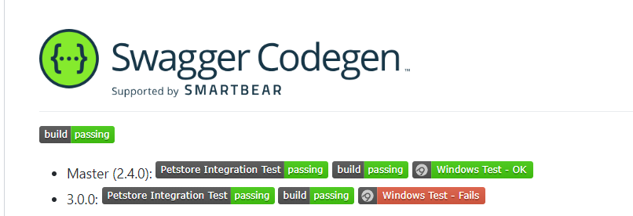
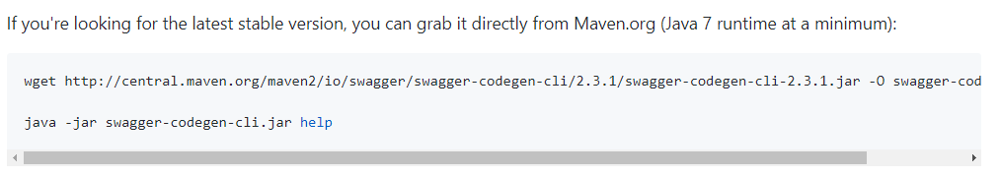
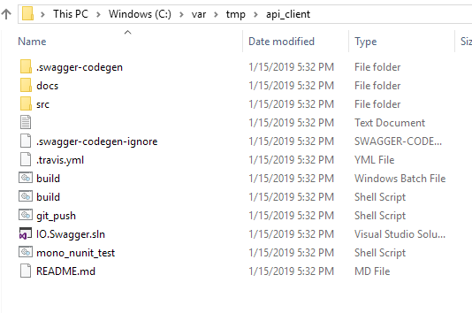
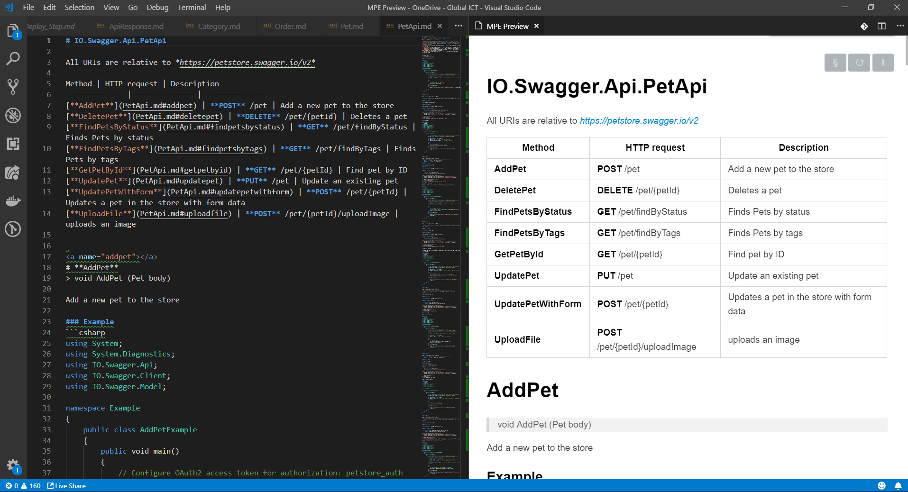
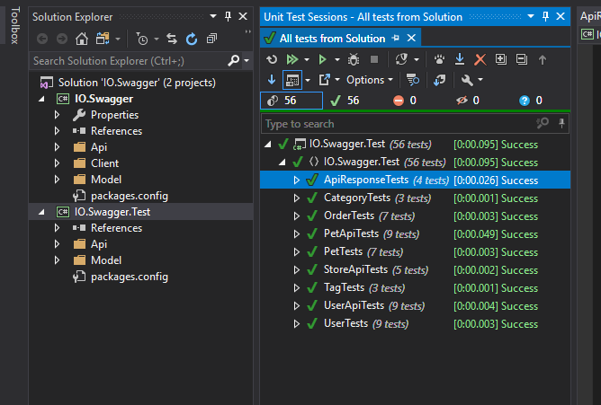

# Swagger Codegen — 自動產生文件的工具

寫 Web API 的開發人員多少都用過 Swagger 這個工具，結合到 ASP.Net MVC 專案上，就會讀取程式碼裡的註解以產生 API 文件頁面。不論是加新 API 或修改 API，只要記得增加/調整註解，Swagger 就能夠產生出最新的 API 說明文件。也因此我再也沒有另外手動維護任何靜態文件了。


from: https://petstore.swagger.io/

由於工作流程的需求，並不是所有人都知道 Swagger 的存在，而且 Swagger 是直接結合在 ASP.Net MVC 專案上，通常為了安全性只會讓開發環境可以使用 Swagger，其他環境會將 Swagger 關閉。另外也不是所有人都能存取開發環境。為了讓沒辦法看 Swagger 但又有看文件需求的人也可以看文件，就有了產生靜態文件的需求(嘆)。

身為懶惰的開發人員，實在不想再另外維護一份文件，只能上 google 找找有沒有什麼比較好的工具可以簡化這個作業，就讓我找到了這個工具 Swagger Codegen。

它的網頁上就清楚明白的說它可以產生 API Client 及 Documentation。



from:https://github.com/swagger-api/swagger-codegen#overview

看完就直接動手試驗了，我一開始直接參考文件裡 Getting Started 這個段落，安裝了 Java JDK、Maven，嘗試著去 Build 出一個 Swagger Codegen，但一直 fail 在 unit test，想說怎麼會連 test 都不能 pass？會不會是我的環境還缺了些什麼？文件翻來翻去看了老久，終於注意到文件開頭的 Build Badge 。



沒錯！3.0.0的版本 windows Test 是 Fail的…Orz

由於我對 Java 沒有很熟，也不想花時間去改 Code，直接 checkout 2.4.0 的版本重 Build 後，總算是 Build 成功了，試著產生文件也成功了(灑花)，但人生也己經浪費 2 個多小時。

就當正要將這個過程做個記錄的同時，又在文件中看到一句話。




以後文件要先看清楚，人生可以不用多浪費 2 個小時。不過也多學了怎麼 Build Java 程式，也算是個意外的收獲。

以下的操作方法就是直接從官方下載 Jar 來操作，省去了安裝與建置的時間。

## 操作方法：

先下載官方已經發行的穩定版本 點我下載
打開 command line 輸入以下的指令

```cmd
java -jar swagger-codegen-cli-2.3.1.jar generate -i http://petstore.swagger.io/v2/swagger.json -l csharp -o /var/tmp/api_client
這裡有三個參數：
```

- -i：指定你的 swagger.json取得路徑，如果你的 Web API Application 已經使用 Swagger，你可以直接換成你的 swagger.json url。這裡的例子用的是官方Sample
- -l：要產生何種語言的文件。codegen支援的語言蠻多的，詳細內容可以到官方 github 查閱。
- -o：將文件產生到指定目錄

沒意外的話，就可以得到一堆檔案。



docs 目錄裡就有將你的 API 轉成 Markdown 格式的文件，你就可以直接拿來使用而不需要再動手另外再寫一份文件，同一件事別浪費時間做兩次。



而 src 目錄是有可以拿來 build 的 sample code，你可以用 Visual Studio 打開 IO.Swagger.sln，就是一個可以直接呼叫 API 的簡易程式，還附有 unit test ，建置之後試著執行 Unit Test，是真的可以 run 的。



## 心得

若公司是有像是 SharePoint、Wiki 這類的 KM 工具，要求將 API 文件上傳到這類的系統，就可以使用今天介紹的工具，產生出 Markdown 文件來上傳。若可以結合 CI/CD 流程，每次上版時就自動產出相關文件，並自動上傳更新，讓文件能夠隨著程式碼一併更新，如此就能夠讓文件活起來，成為活文件。

今天若是一個要界接 API 的 Developer，也可以使用 Swagger-Codegen 先自動產生出這些 Sample Code，讓 Sample Code 成為基底，在開發速度上也能夠有所助益。

## 參考資料

- [github swagger-api/swagger-codegen](https://github.com/swagger-api/swagger-codegen)
- [github chenjianjx/swagger2html](https://github.com/chenjianjx/swagger2html)
