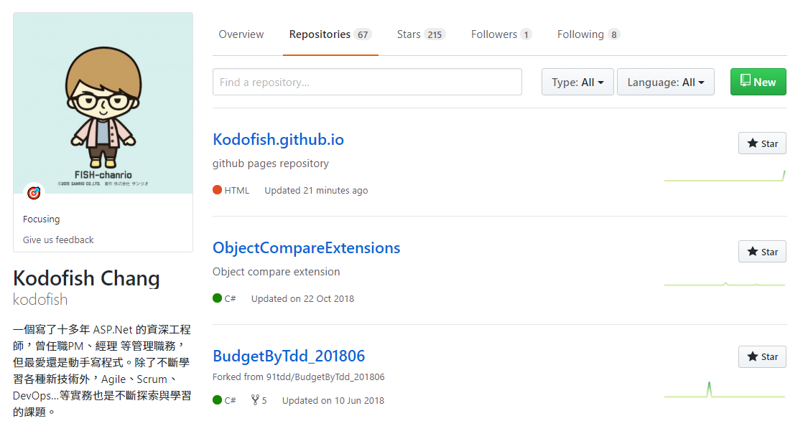
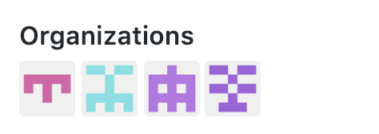
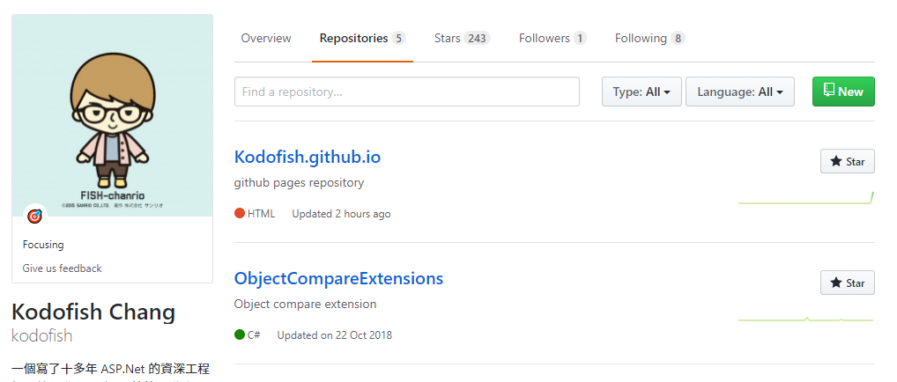
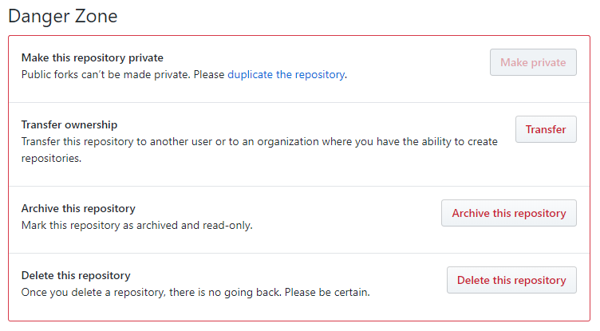
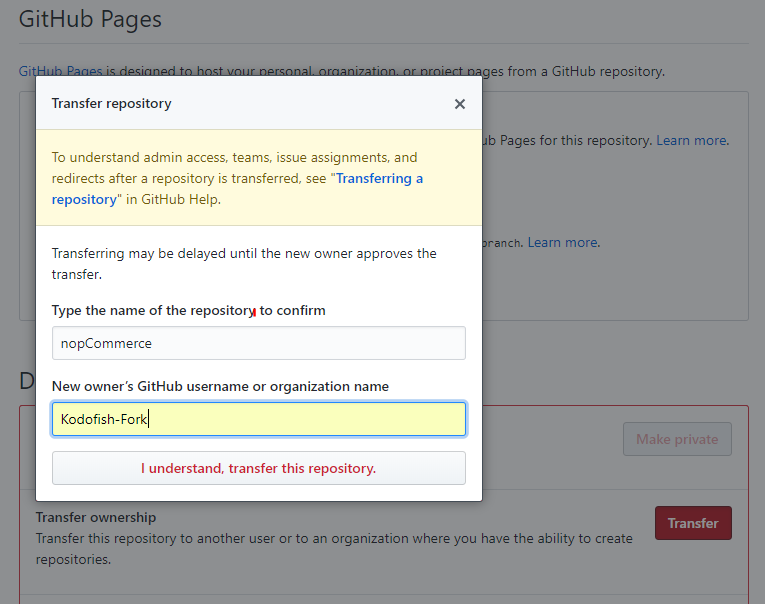

各位有在使用 GitHub 的攻城獅/程序猿們，你們曾經整理過你們的 GitHub Repositories 嗎？你們的 Repositories 是否充斥著到處 Forks 回來的 Repository，而雜亂不堪？這邊介紹一下我自己在整理 GitHub 的小技巧。

<!--more-->

不知道各位是否曾經像我一樣 Repositories 裡有一堆的專案，如果你是參與了許多專案的開發，而且都有貢獻自己的心力在上面的話，專案數多還挺合理的。

但如果是像我一樣只是 Fork 了一堆專案回來，也沒有真正 Pull Request，只是空有數字罷了。如果你也是這樣，建議你繼續看下去。

我也曾經有一堆的 Repositories

我會有一堆 Repositories 是因為早期剛開始使用 Github 時，那時候還搞不太懂 Fork 的功能到底是做什麼用的，只知道 Fork 會把別人的專案複製到自己的 Repository 裡，每當看到有興趣的專案或是為了工作所看到的專案都 Fork 回來，久而久之就如同上圖有 67個之多。

但擁有這麼多專案並不能為你帶來什麼樣的好處或價值，尤其 Github 幾乎是觀察一個攻城獅平時在學習什麼樣的技術，或是觀察能力的途徑，也越來越多公司會要求提供 GitHub 連結，做為面試的一環。因此，錯誤的使用 Fork 會為你帶來以下幾個缺點：

- 無法輕易了解你最近貢獻了那些 Project。
- 無法了解你 Fork 這些專案的意圖為何？
  
## 解決辦法

我自己是使用 Github 的 Organizations 功能來充當分類資料夾，每一個 organization 有不同的定義，用來存放相同類型的 Project。

我用 Organizations 充當資料夾

我目前是建立了以下這些 Organizations

- Kodofish-Forks：這裡放我近期內仍有可能會用的專案，一旦放到這裡並留了一段時間後仍然沒有使用，代表其實不會去用它，就可以考慮將它刪除。
- Kodofish-Old：這裡就存放過去所寫的 Project，這些 Project 可能只是當初實驗某些功能、一時興起寫的、或已經沒什麼人關注的 Project。這些專案我不太建議刪除，原因是這些都是你過往的歴程，即使沒用，但也都是你的一部份。
- Kodofish-Learning：這裡的專案就會放我去上課時要繳交的作業；或是我自己在學某些技術時所做的 Project，這些 Project 可以代表你在學習時所留下的記錄。

## Repositories 放些什麼？

我目前 Repositories 就只留下以下的幾個 Project

- 長期維護的project，例如：blog、文章。
- 最近一直投注心力的 side project。
- 目前正在學習的新技術。

目前我的 Repositories 就只剩下五個 Project，對我自己而言能夠一目了然我當前有那些 Repositories 是我該關注的，而不會陷入一堆 Repositories 之中。整理乾淨的 Repositories 也能夠給予別人一種整理乾淨、可讀、可維護的感覺。

整理後就只剩下5個 Repositories

## 如何移動 Repository

Organizations 建立好後，只需要進到 Repository > Settings，將頁面拉到最底就會看到 Danger Zone 的區塊，這裡就有 Transfer ownership的功能，就可以將 Repository 移到特定的 Organizations了。

以上的方法是我自己整理 Repository 時所使用的方式，這方式似乎是有一點濫用了 Organizations 的功能，不過我想這些 Repositories 都是自己在維護的，用這方法更能夠一目了然各 Project 目前的狀態，Z ＞ B 的情況下這樣用也無妨。

另外我也想收集一下有用 Github 的各位，你是如何整理你的 Repository 呢？歡迎在底下留言跟我分享。