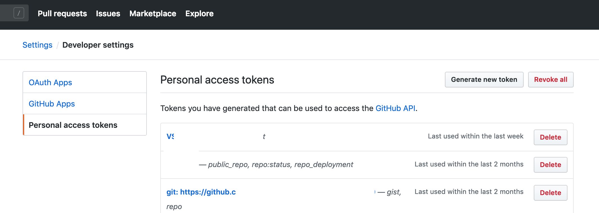
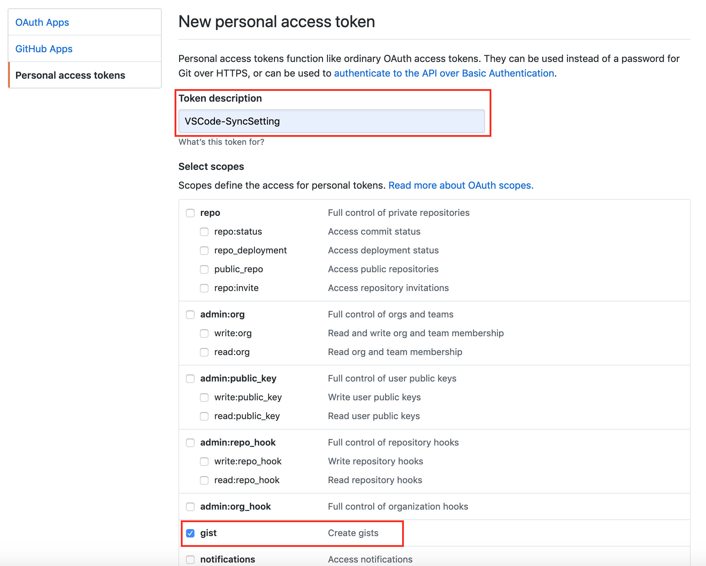
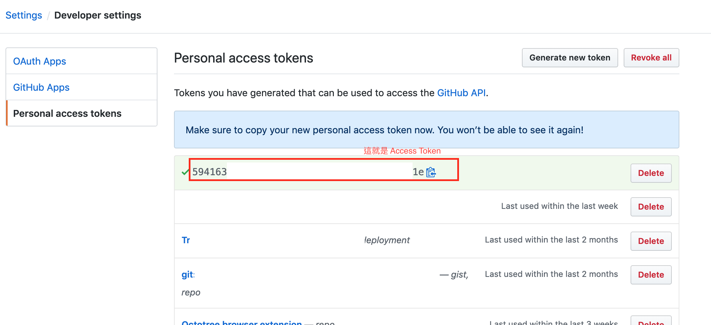
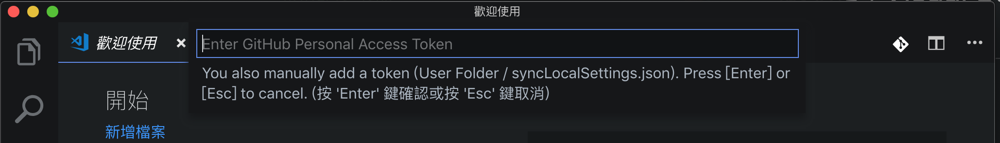
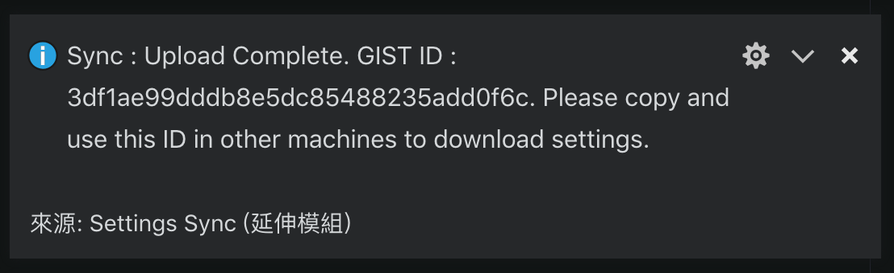
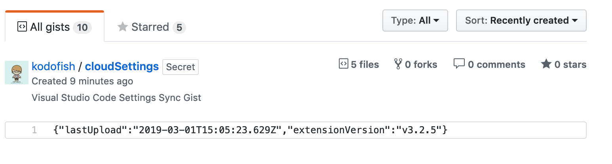
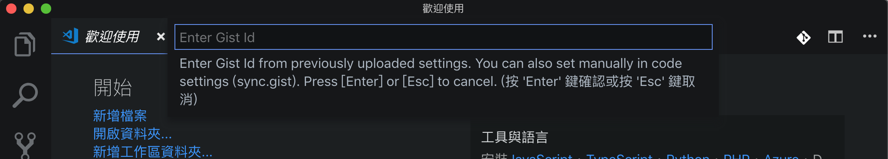

Visual Studio Code 是平常工作之外最常使用的編輯器了，不論是寫文件、查 Log、寫 Blog 都是用 Visual Studio Code。平時寫 Code 用的 Visual Studio 2017 本身就有設定檔同步的功能，不論我在公司或在家中使用時，都有一致的操作環環境與體驗。但 Visual Studio Code 卻沒有內建類似的功能，每當我新增了 Extension 或修改了設定，就必須再次在另一台電腦上手動再做一次，有點不方便。抱著這樣的困擾在 Google 上找了一下，就找到了今天想為此寫篇文的 Extension [Settings Sync](https://marketplace.visualstudio.com/items?itemName=Shan.code-settings-sync)。

## Settings Sync 能做什麼？

`Settings Sync` 有幾個主要的功能。

1. 使用你的 Github 帳號及 Gist 來做為設定檔的儲存與下載使用。
2. 透過快速鍵就可以上傳或下載設定檔
3. 每次啟動 Visual Studio Code 會自動下載設定檔。
4. 設定檔是儲存在 Gist 上，也因此你可以將你的設定檔分享給其他人

Settings Sync 會同步 Visual Studio Code 的幾個設定檔，包含：

1. Settings File
2. Keybinding File
3. Launch File
4. Snippets Folder
5. VSCode Extensions & Extensions Configurations
6. Workspaces Folder

## 建立 Github access token

Settings Sync 會需要使用你的 Github 及 Gist，所以如果你還沒有 Github 帳號的話，那趕快先去申請一個帳號，才能夠跟著繼續操作下去。

安裝了 Settings Sync 這個 Extension 後，使用方式蠻簡單的，就兩個快速鍵。

- 上傳設定檔：Shift + Alt + U
- 下載設定檔：Shift + Alt + D

在開始操作前請先到 Github > Settings > Develop Settings > Personal access token > Generate New Token

在 Token description 欄位輸入方便記憶的描述，例如：`VSCode-SyncSetting`。Scope 只需要給予`gist`就可以了。

建立完成後就會將 Token 顯示在畫面上，記得把 Token 記下來，離開這個畫面後就消失了，也無法查詢。

## 第一次上傳設定檔

有了 Token 就可以來進行設定檔同步作業，先按下 `Shift + Alt + U`，第一次操作時 Visual Studio Code 會詢問你的 Github access token，

輸入你的 access token 後就完成了設定，此時 Settings Sync 會開始將設定檔上傳至 Gist，完成後會有一個上傳完成的通知。

這個 Gist ID 請把它記下來，後續要讓另一台電腦下載設定檔就需要這個 Gist ID。

如果沒記下來也沒關係，只要連到你的 Gist，就可以看到剛剛 Settings Sync 所上傳的內容 `cloudSettings`。

點進去 `cloudSettings` 觀察一下網址。

網址格式會長這個樣子。

> `https://gist.github.com/{YourAccount}/{Gist ID}`

網址最後一串英數字組成的就是 Gist ID。

## 下載設定檔

換到另一台電腦，一樣在 Visual Studio Code 裡先安裝上 `Settings Sync` Extenstion。安裝後按下 `Shift + Alt + D`，此時一樣會詢問你的 Github access token，接著就會再詢問你的 Gist ID。

填入後，就完成設定檔的同步啦。

## 最後

Settings Sync 完全解決我期望的同步設定檔的需求，是一個很簡單使用的外掛，也希望這篇文章能夠幫助跟我有同樣需求正在看文章的你。
