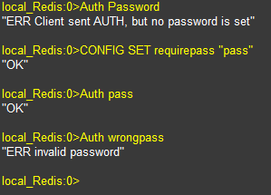

使用 Redis 時為了增加其安全性，不讓其他人可以隨時連進 Redis 進行操作，通常都會設定一組密碼。而密碼的設定除了透過修改 Redis config 之外，Redis 也提供了一個指令可以直接在線上進行修改，而且不需要重啟服務。

這次所要使用的指令就是 `CONFIG SET`

使用 CONFIG SET 修改除了立即生效外，所支援的參數都與 redis.config 文件內所使用參數相同。

使用上挺簡單的，先使用 Redis-cli 連上 Redis。

### 使用 Redis-Cli 進行測試

先使用 `Auth password` 來測試是不是有設定密碼，預設情況下是不會有密碼的，所以 Redis 回給予 `ERR Client sent AUTH, but no password is set` 的訊息。

### 使用 CONFIG SET 指令設定密碼

接下來輸入以下的指令

```bash
CONFIG SET requirepass "pass"
```

這段指定就是將 redis 密碼修改為 `pass`。
CONFIG SET 可以修改的設定相當多，我們這次是要設定密碼，在 Redis config 裡的屬性就是 `requirepass`。輸入後看到 `OK` 代表修改成功了。

### 再次測試密碼

一樣透過 redis-cli 連上 Redis 後, 輸入以下指令

```bash
Auth pass
```

redis 會回應"OK"的訊息，代表密碼驗證成功，就可以繼續操作 redis 了。若是在 Auth 輸入錯誤的密碼，就會回應 `ERR invalid password` 的訊息。



## 參考資料

[CONFIG SET](https://redis.io/commands/config-set)