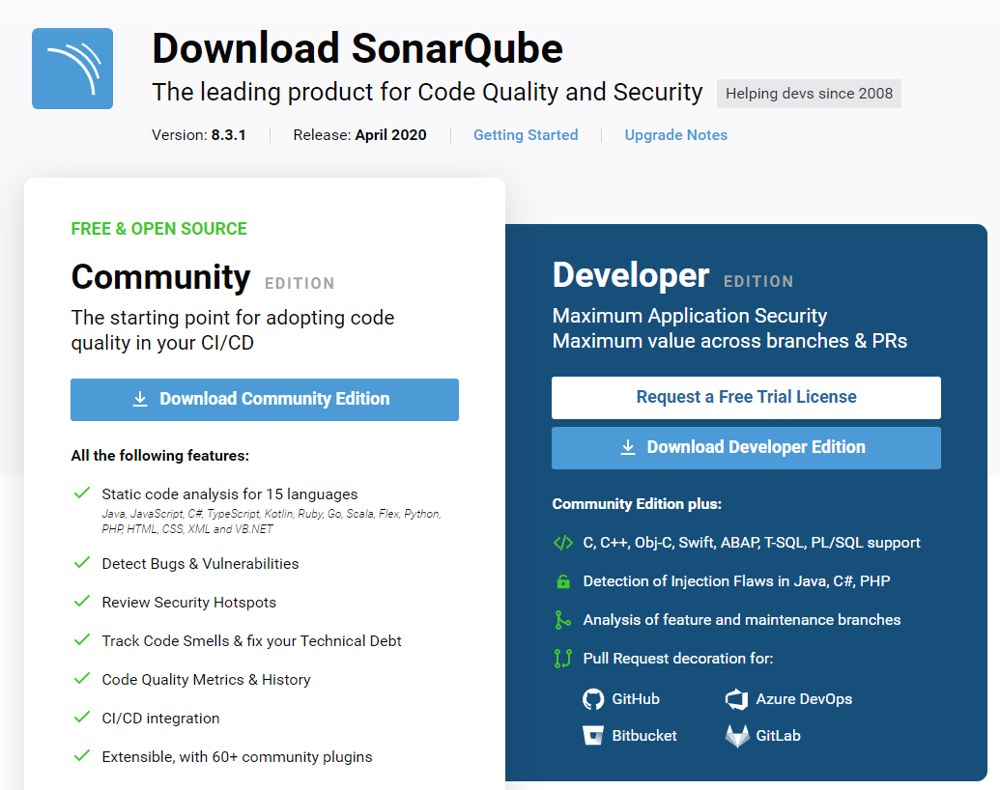
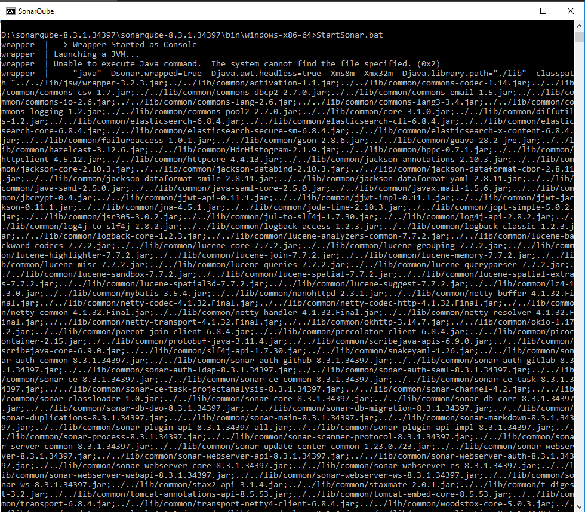
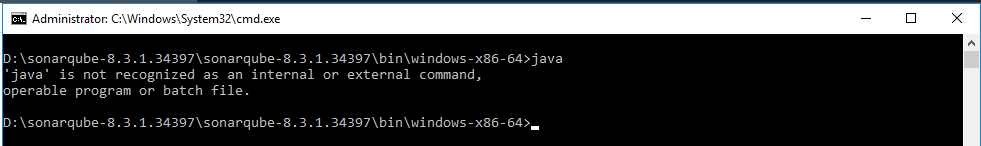
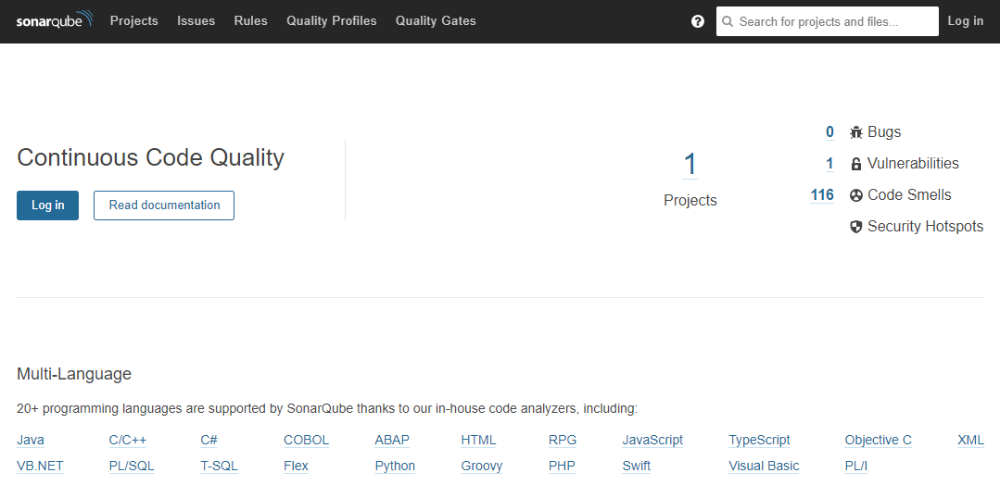

從事軟體開發工作已經多年，軟體品質、工程師績效向來是一直難以量化呈現的問題。過去曾看過管理階層試圖以各種方式來定義，但總有許多技術上的問題與人性挑戰。無法量化，團隊就難以對於品質有一致的認知，沒有一致的認知在開發的過程中多少就會有些許的衝突。

而 SonarQube 就是個讓你可以把團隊的軟體品質給數據化呈現出來軟體，也能讓團隊瞭解所開發的軟體是否有些潛在的問題。

> 如果你無法加以量度，或是無法以數字將之表達出來，那麼你對於那樣東西的所知，則要歸於貧乏之列，或是嚴重不足— Lord Kelvin

這篇來講講 SonarQube 安裝，這篇是我在安裝 SonarQube 時的安裝過程整理，

## 下載 SonarQube

在 [SonarQube 官網](https://www.sonarqube.org/downloads/) 提供了幾個版本可以下載，分為 Community、Developer、Enterprise 與 Data Center 四個版本，可依自己的需求下載適合的版本。由於這次是先試用評估功能，所以就先下載 Community 的版本。



## 快速啟動 SonarQube

這方式蠻適合想先試用 SonarQube 評估對於團隊的幫助有多少時，可以先用快速安裝來減少前期準備的時間。
將先前下載的 SonarQube 解壓縮並放在適合的位置後，以命令列執行 StarSonar.bat。例如：

```batch
$SONARQUBE-HOME\bin\windows-x86-xx\StartSonar.bat
```

就官方文件上寫的，這樣應該就可以啟動 SonarQube 了，但我執行就看到這樣的訊息。



在訊息的一開始有個 `Unable to execute Java command.` 的訊息，猜想可能是找不到 java 執行檔, 試著用 command line 去執行 java。



果然!! 找不到 Java，找不到 java 就將 java 加入環境參數內，再重新執行一次。這次就順利執行起來了, 打開瀏覽器輸入 `http://localhost:9000/` 看到 SonarQube 的畫面就完成了。

- [SonarQube - Get Started in Two Minutes Guide](https://docs.sonarqube.org/latest/setup/get-started-2-minutes/)

## 完整安裝 SonarQube

前一節的快速啟動算是可以讓你用較短的時間將 SonarQube 執行起來，並開始試用它。但只要伺服器重新開機就必須手動再重新執行一次，對於長期使用來說並不方便，而且前面也提到過沒有安裝資料庫，未來若是程式升級或是你想要搬伺服器的話，資料有可能是無法轉移的。因此這一節來說說該如何完整安裝 SonarQube。

在執行 SonarQube 前，有兩件事要先準備好。第一是安裝 Java JRE 11。第二是安裝資料庫。

### 安裝 Java JRE 11

在這一步，我本來是想照著文件安裝 Java JRE 11 就好了，但找來找去找不到, 索興安裝 Java JDK 11。

- [Java JRE 官方下載](https://www.oracle.com/java/technologies/javase-jdk11-downloads.html)

### 安裝資料庫

這個步驟是可以略過的，SonarQube 就會將資料儲存在本地，但這方法官方有說是不支援未來的升級與轉移的，所以已經確定要正式導入團隊使用時，建議還是採用完整安裝，建立專用的資料庫來讓 SonarQube 使用會比較恰當。

資料庫支援 PostgreSQL、MS SQL、Oracle 這種資料庫，就挑選自己熟悉或喜歡的裝，若是用在公司還是要考量公司的技術偏好與可支援的程度來決定，這篇文章就不特別寫該如何安裝資料庫。

- [SonarQube - Prerequisites and Overview](https://docs.sonarqube.org/latest/requirements/requirements/)

### 設定資料庫

在準備好資料庫後, 編輯 `$SONARQUBE-HOME/conf/sonar.properties` 這個設定檔來設定資料庫，這裡我使用 Oracle。設定參考如下，請再自己換成屬於自己環境的設定。

```config
# User credentials.
# Permissions to create tables, indices and triggers must be granted to JDBC user.
# The schema must be created first.
sonar.jdbc.username=username
sonar.jdbc.password=password
#----- Oracle 11g/12c/18c/19c
sonar.jdbc.url=jdbc:oracle:thin:@127.0.0.1:1521:sonarqubedb
```

### 下載 jdbc driver

使用 Oracle 時還得要自己另外載下 jdbc driver, 並放到 `$SONARQUBE-HOME/extensions/jdbc-driver/oracle` 這個目錄底下，要特別注意的是千萬要下載 V12.1 以上的版本，像我一開始就是下載 v11.2.0.4.0 的版本，一直無法讓 Service 順利執行起來，還以為是不是連線字串有誤，查了老半天擔誤了不少時間後，才在 Log 裡看到一行錯誤訊息。

> Caused by: org.sonar.api.utils.MessageException: Unsupported Oracle driver version: 11.2.0.4.0. Minimal supported version is 12.1.

這個錯誤就讓我多花了快兩個小時的時間...Orz

- [Oracle JDBC Driver download](https://www.oracle.com/database/technologies/jdbc-upc-downloads.html)

### 將 SonarQube 以 Windows Service 執行

SonarQube 已經準備好 Service 的執行檔，要安裝時執行

```batch
%SONARQUBE_HOME%/bin/windows-x86-64/InstallNTService.bat
```

解除安裝

```batch
%SONARQUBE_HOME%/bin/windows-x86-64/UninstallNTService.bat
```

要啟動或停止服務也只要執行以下的命令

```batch
%SONARQUBE_HOME%/bin/windows-x86-64/StartNTService.bat
```

```batch
%SONARQUBE_HOME%/bin/windows-x86-64/StopNTService.bat
```

Service 啟動後，打開瀏覽器輸入 `http://localhost:9000/`，看到 SonarQube 的畫面代表安裝已經完成。



- [SonarQube - Install the Server](https://docs.sonarqube.org/latest/setup/install-server/)
- [SonarQube - Operating the Server](https://docs.sonarqube.org/latest/setup/operate-server/)