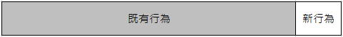

> 這一系列文章是我在閱讀 Working Effectively with Legacy Code 這本書的書摘，其中穿插著我對於部份內容的心得。我盡可能的重新用自己的話與理解來寫這一系列文，好讓自己能夠重新整理書中的內容。若對於此書有興趣，也同時被遺留代碼殘害的工程師非常推薦將這本書買回去好好的閱讀。

## 修改軟體的四個理由

1. 添加新特性
2. 修正 Bug
3. 改善設計
4. 最佳化資源使用

### 添加新特性與修正 Bug

這應該是一個正在發展中的產品會因為不斷的在現有產品上不斷加上新工能，RD 得不斷的在現有的 程式碼中進行添加或修改。但對於新增功能還是 Bug 的修改，這點對於不同角色會有不同的看法，這是很主觀的。

### 改善設計

改善設計是另一種軟體修改，在不改變軟體既有的功能及行為下，修改軟體的結構或組織，讓軟體可以更容易維護。但這樣的操作很容易產生 Bug，因此有多數的程式設計師都盡可能不去做這件事，深怕產生了新的 Bug 會被抓出來當戰犯審問。

這樣的操作被稱之為重構(Refactoring)。重構的概念是先撰寫測試以確保軟體現有的行為不被改變，每做一小步的修改就執行一次測試，小心驗證軟體行為沒有被改變。

有一個跟重構很像的行為叫"程式碼清理(Clean UP)"，與重構的不同在於重構會做比較危險的修改，例如重寫程式碼區塊、將部份程式碼抽出成一個 Method…等。

### 最佳化

這部份與重構類似，但目標不同。兩者都是在不改變軟體功能行為下進行操作，但會改變某些其他東西。不同的是重構改變的是軟體組織或結構；而最佳化改變的是某些資源的使用，例如 CPU 負載、記憶體的使用量。

### 四個理由的比較

|          | 添加特性 | 修正 Bug | 重構  | 最佳化 |
| :------: | :------: | :------: | :---: | :----: |
|   結構   |   改變   |   改變   |   -   |   -    |
|  新功能  |   改變   |    -     |   -   |   -    |
|   功能   |    -     |   改變   |   -   |   -    |
| 資源改變 |    -     |    -     |   -   |  改變  |

綜合比較添加特性與修正 Bug 的行為相當相似，所不同的在於添加特性改變的是"新功能"，而修改 Bug 改變的是"原有功能"。

添加特性、重構、最佳化都是維持現有功能不變，在這一點上是相當相似的。但我想要保持不變的地方是要多上許多的。

行為保持我們以為只要關注在"新行為"上即可，只有修正 Bug、重構、最佳化時才需要關注在既有行為上。但事實上是，保留既有行為不變並非意味著不要碰這些程式碼就可以了，我們還是要去知道這些行為是不是有被改變，這才是最大的挑戰，因為通常行為被變更都是在修改的過程中不經意的被變更了。

就算是添加新特性，也是有很大的機會會異動到既有行為。

### 危險的修改

要保持原有功能的不變是很大的挑戰，作者認為要減少風險需要考慮三個問題：

1. 我們要進行哪些修改？
2. 我們如何得知已經正確地完成了修改？
3. 我們如何得知沒有破壞任何既有的行為？

作者提到他曾經共事的團隊大多會採取相當保守的策略來避免風險，把會變動 code 的數量降到最低、能不異動就不動、沒有故障就不動它。

這種方式在我過去的工作經驗中也常常遇到，但盡可能不動就會讓軟體越來越陌生，你會越來越無法理解這軟體究竟是如何運作的，軟體也會越來越肥大，終究有一天長成巨大怪獸後，團隊受不了、主管不明白到底為什麼會變成這樣的同時，就會有個人跳出來決定要重寫軟體或找個理由開發一套新的軟體。

人們會【避免】修改，之所以避免是由於自己對於要修改的部份沒有信心，因為沒有方法可以讓自己知道這個修改到底有沒有風險，你可能需要花許多時間去理解要修改的區域，你卻可能沒有這麼多的時間可以去理解，這時好的系統與系統之間的差別就顥現出來了。

而避免修改會導致一個後果，就是對於修改程式碼的技術生疏，例如：重構技術，因為沒有學習或練習的機會。許多人對於重構的理解僅止於把程式碼搬搬位置，調換順序的階段。然而重構是門藝術，它可以讓你的程式碼隨著需求而不斷的演進。不熟悉重構就會讓你的程式碼不斷的長大而非演進。

還有一個後果就是讓團隊一直處在恐懼的狀態下，不知道那天會踩到何種地雷，恐懼越多也就越不敢修改軟體。

### 該如何做

書中提到避免修改是不可取的方法，反而應該是要盡量的去修改。但可能會產生許多人力的需求。採用 Code Review 就一定能控制風險嗎？能夠確保風險被控制嗎？Code Review 後就能確切知道事情有被做對嗎？
繼續往下看也許就能夠找到合理的答案了。
