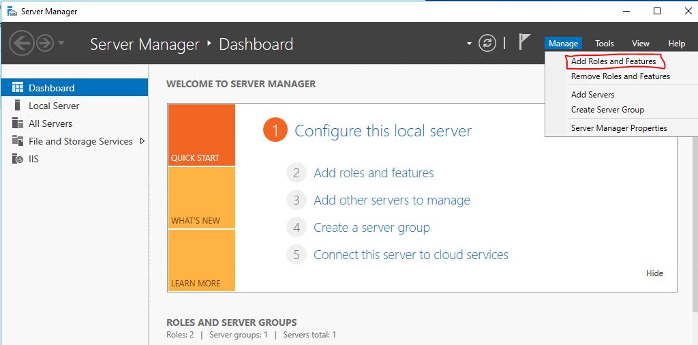

+++
title = "如何設定 ASP.NET Core 網站應用程式持續執行在 IIS 上"
date = 2021-04-08T00:00:00+08:00
keywords = ["IIS", "ASP.NET Core"]
categories = ["ASP.NET Core", "IIS"]
tags = ["IIS", "ASP.NET Core"]
+++

在 IIS 預設的設定下，只有在收到第一個 Request 後才會啟動執行網站應用程式。啟動後若 20 分鐘都沒有收到任何新的 Request 時，就會將應用程式給中止。

若你要讓網站應用程式定時做一些背景工作，在 IIS 預設的設定下，你得在部署後發一個 Request 讓程式啟動，然後每 20 分鐘內再發一個 Request 讓 IIS 不會將程式給中止。

但這樣實在是太麻煩了，雖然有許多方式可以做到，但其實 IIS 本身是可以做到持續執行的，要做到這點有三個步驟。

1. 安裝 Application Initialization Module
2. 設定 Application Pool
3. 設定 IIS Web site

## 安裝 Application Initialization Module

這是最重要的一步，有時候就是忘了安裝它造成網站應用程式無法持續執行。首先執行 Server Manager，再點選 Manager > Add Roles and Features

順著 Add Roles and Features Wizard 一直到 Server Roles 時, 在清單中找到 Web Server (IIS) > Web Server > Application Development > Application Initialization，把它選起來並安裝它。

## 設定 Application Pool

在 IIS 裡找到你的網站應用程式所使用的 Application Pool，按右鍵叫出選單，點選 Advanced Settings

調整以下的設定值

- .NET CLR Version 為 v4.0
- Start Mode 為 Always Running
- Idle Time-out (minutes) 為 0

Idle Time-out 設定為 0 代表著 IIS 不會主動停掉應用程式。Start Mode 設定為 Always Running 代表 IIS 會立即啟用應用程式而不用等待收到 Request 才執行。

## 設定 IIS Web site

在 IIS 中，在網站上按右鍵叫出選單，點選 Manage Website > Advanced Settings

將 Preload Enabled 設定為 True。

## 驗證

照著步驟做應該就能夠設定完成了，你可以將工作管理員打開，找到網站應用程式的執行緒，點選 End Task 將它關閉。

有設定成功的話就會馬上再生出一個新的執行緒，可以看到 PID 會有所不同。

## 參考資料

- [IIS 8.0 Application Initialization](https://docs.microsoft.com/en-us/iis/get-started/whats-new-in-iis-8/iis-80-application-initialization)
